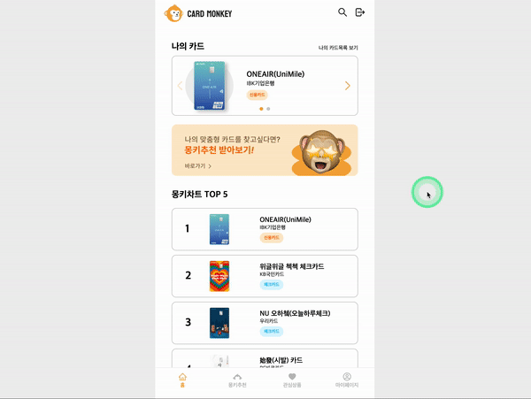
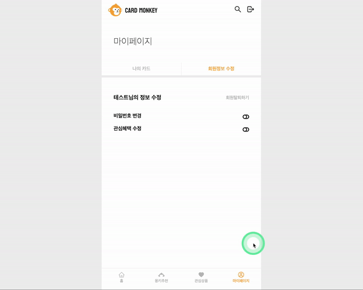

<h1>Card Monkey</h1>
  
    <h3>
    <b>< KDT3 Front-End : Mini Project Team2 ></b>
  </h3>

---

# 1. 프로젝트 소개 💁

### 프로젝트 설명

- 패스트캠퍼스의 핀테크 미니 프로젝트로 진행된 프로젝트입니다.
- 금융상품 중에서 카드를 상품으로 다루고, 추천해주는 서비스 입니다.
- 로그인을 하지 않으면 이용할 수 없습니다.
- 주된 기능으로는 로그인, 회원가입, 나의 카드(신청한 카드), 검색, 카드 추천, 관심상품이 있습니다.

### 개발 기간

- 1차: 2023.2.13 ~ 2023.2.24(총 12일)

### 링크 모음

&nbsp;&nbsp;

  

# 2. 팀원 소개 & 역할 분담 👥

|                                                        소재헌👑                                                         |                                                        이혜란                                                         |                                                          우지수                                                          |                                                         공혜지                                                          |
| :---------------------------------------------------------------------------------------------------------------------: | :-------------------------------------------------------------------------------------------------------------------: | :----------------------------------------------------------------------------------------------------------------------: | :---------------------------------------------------------------------------------------------------------------------: |
|  |  |  |  |
|                     카드 추천 페이지 카드 검색 페이지  초기세팅, 헤더   관심상품 페이지                      |                               메인 페이지 (신청한 카드, TOP5 카드) 내 정보 페이지                               |                            로그인 회원가입/탈퇴 혜택 변경  네비게이션 바 디자인                            |                                        카드상세 페이지  api관리   Up 버튼                                        |

  

# 4. 기술 스택 ⚙️

   
  

  

# 5. 협업 방식 🤝

  

- **Github**
   팀 레포지토리를 만들었습니다.
   develop 브랜치와 각자의 이름으로 브랜치를 생성하고,
   작업이 끝나면 각자의 브랜치로 push 후 pull request를 남기면 팀장이 merge 했습니다.
- **Notion**
   팀원별 진행 과정을 공유하고 회의록을 작성할 때 사용했습니다.
- **Discord**
   회의할 때 주로 사용했고, 설명이 필요한 부분들은 화면도 종종 공유했습니다.
- **Slack**
   간단한 질의/응답/요청 등을 위한 메신저, 혹은 pull request 알리미로 사용했습니다.

  

# 6. 구현 내용 🛠︎

헤더

- 로고 클릭: 메인 페이지로 이동
- 돋보기 클릭: 검색 체이지로 이동, 검색 페이지에서는 검색 input 렌더
- 로그아웃 클릭: 로그아웃 되어 로그인 페이지로 이동

네비게이션 바

- 메인 페이지, 추천상품 페이지, 관심상품 페이지, 내 정보 페이지로 이동할 수 있는 네비게이션 바
- react-router 사용

   
로그인 페이지

- 로그인을 하는 페이지

   
회원가입 페이지

- 총 5단계로 이루어지는 회원가입 페이지
- 1단계: 약관 동의
- 2단계: 이름 설정
- 3단계: 아이디 설정, 아이디 중복 확인
- 4단계: 비밀번호 설정
- 5단계: 혜택 설정
   

메인 페이지

- 회원이 신청한 카드목록을 swiper를 활용하여 보여줌
- 인기 TOP5 상품을 보여줌(관심상품으로 등록된 기준)
- 추천 배너 클릭 시 추천상품 페이지로 이동
- 공유 배너 클릭 시 링크 복사

검색 페이지

- 카드명, 카드사, 카드혜택 별 검색 기능
- 신용, 체크 필터링
- redux를 사용하여 검색결과, 검색 태그들 관리

상세 페이지

- 해당 카드의 상세 정보를 보여줌(카드명, 카드사, 주요혜택)
- 카드 신청, 관심상품 추가 및 삭제 가능
- 하단에 회원의 추천 상품 보여줌

관심상품 페이지

- 회원이 관심상품으로 등록한 카드들을 보여줌
- redux를 사용하여 관심상품 관리
- 하트를 클릭하여 관심상품에서 삭제, 추가 가능
- 카드 클릭 시 상세페이지로 이동
   

   
추천상품 페이지

- 회원이 가입할 때 선택한 3개의 혜택을 기반으로 상품을 추천
- 항상 랜덤으로 추천
   

   
내 정보 페이지

- 회원이 신청한 카드 목록을 보여줌, 신청 취소 가능
- 신용, 체크 필터링
- 회원 정보 수정에서 비밀번호 변경, 회원 탈퇴 가능
   

  

# 7. 시연

### 회원가입

 

### 로그인,로그아웃

 

### 메인페이지

 

### 검색

 

### 몽키추천

 

### 관심상품

 

### 상세페이지

 

### 마이페이지

#### 신청 카드 조회 및 신청 취소

 

#### 비밀번호 수정

 

#### 혜택 변경

 

#### 회원탈퇴

 

# 8. 아쉬운 점

- 검색 페이지에서 무한스크롤을 하지 못한 점이 아쉽다. 백에서 페이지 네이션을 지원하지 않아서 검색 결과를 모두 가져오는데 이것을 프론트에서 10개씩 쪼개어서 무한스크롤로 보여주려고 했지만 시간상 하지 못했다.

- 검색 페이지에서 검색 된 상품을 클릭하여 상세 페이지로 이동 후 뒤로가기를 하여 돌아오면 다시 검색을 해서 리렌더링 되는 문제가 있어서 이것을 해결하려 했지만 못했서 아쉽다.

- 토큰이 만료되면 로그인 페이지로 리다이렉트 되는 로직을 완벽하게 구현하지 못한 점이 아쉽다.
